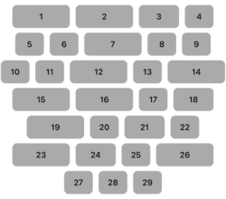
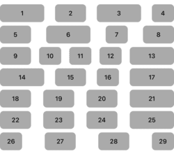
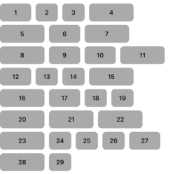
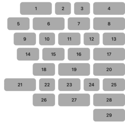
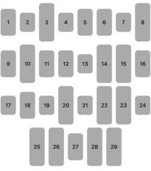
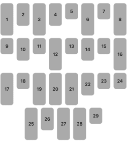
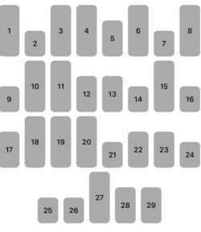

# MAlignedCollectionViewFlowLayout
Overridden implementation of the standard UICollectionViewFlowLayout that aligns elements.

## Horizontal aligment
### .center
`flowLayout.horizontalAlignment = .ceneter`



### .fill
`flowLayout.horizontalAlignment = .fill`



### .left
`flowLayout.horizontalAlignment = .left`



### .right
`flowLayout.horizontalAlignment = .right`



## Vertical aligment
### .center
`flowLayout.verticalAlignment = .center`



### .top
`flowLayout.verticalAlignment = .top`



### .bottom
`flowLayout.verticalAlignment = .bottom`



## Animation
You can also change the alignment with animation.

```
self.collectionView.performBatchUpdates {
    self.flowLayout.horizontalAlignment = .left
}
```
## Cocoapods

MAlignedCollectionViewFlowLayout is available through [CocoaPods](http://cocoapods.org). To install
it, simply add the following line to your Podfile:

`pod 'MAlignedCollectionViewFlowLayout'`

## Swift Package Manager

### SPM Through XCode Project

* File > Swift Packages > Add Package Dependency
* Add `https://github.com/makhutin/MAlignedCollectionViewFlowLayout.git`
* Select "Up to next Major" with "1.0.1"

### SPM Through Xcode Package

Once you have your Swift package set up, add the Git link within the `dependencies` value of your `Package.swift` file.

```swift
dependencies: [
    .package(url: "https://github.com/makhutin/MAlignedCollectionViewFlowLayout.git", .upToNextMajor(from: "1.0.1"))
]
```